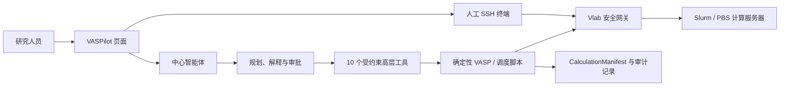

# VASPilot / VASP Remote Agent

面向真实 HPC 环境的、安全可审计、**确定性优先**的 VASP 计算编排智能体。

项目通过本地 Windows 界面连接 Vlab 网关，再访问已登记的计算服务器。中心智能体负责理解需求、规划计算流程、解释结果和发起审批；文件处理、输入生成、任务提交、状态查询、故障检测和结果解析尽量由经过测试的确定性脚本完成。

> 当前版本：`0.1.0`，科研原型。仓库不包含 VASP、POTCAR、密码、TOTP 种子或私钥。

## 为什么这样设计

本项目遵循一个核心原则：

> 能由确定性脚本完成的任务，不交给大模型临时生成代码或自由判断。

大模型适合处理目标理解、流程选择、证据解释、异常分级和人机协作；但输入文件读写、任务提交、状态归一化、结果解析和审计记录更适合稳定脚本。两者分层后，即使未来更换模型或智能体平台，底层科研能力仍可复用。



人工终端与智能体工具是两条独立通道：终端内容不会被主页面复制到聊天记录或模型上下文；智能体不能借用人工终端执行任意命令。

## 当前能力

### 服务器连接与任务管理

- Windows → Vlab → 多台 HPC 服务器的 SSH 链路；
- Vlab PEM 认证与远端密码/TOTP人工输入分离；
- 服务器目录、默认服务器和每台服务器独立的路径边界；
- SSH复用连接、连接状态检查和断开；
- Slurm：`squeue`、`sacct`、`sbatch`、`scancel`；
- PBS/Torque：`qstat`、`qsub`、`qdel`，支持按服务器固定或自动探测调度器；
- 远端读取、目录查看、上传、下载、跨服务器传输；
- 删除先移入 `.vaspilot-trash`，永久清理需要单独审批。

调度器自动探测已在一台PBS服务器和一台Slurm服务器上验证。PBS任务提交、历史查询和取消仍应使用小型测试作业完成生命周期验收后，再用于生产计算。

### VASP确定性工具

| 工具 | 作用 | 当前安全边界 |
|---|---|---|
| `vasp_parse.py` | 将计算目录解析为 CalculationManifest | 相同输入产生确定性结果；pymatgen增强、标准库回退 |
| `workflow_prepare.py` | 生成 relax → static 目录、输入和计划 | 参数白名单、幂等、覆盖保护、`--dry-run` |
| `workflow_state.py` | 管理 PREPARED → REVIEWED 状态机 | 非法转换拒绝、附加式审计、异常终态不可复活 |
| `custodian_detect.py` | 检测 BRMIX、ZBRENT、EDDDAV、NELM 等错误 | 默认只检测；补丁只生成预览，不自动修改 |
| `apply_patch.py` | 应用人工批准的统一补丁 | 文件白名单、备份、前后哈希和 JSONL 审计 |
| `slurm_adapter.py` | 规范化 Slurm 提交、队列和历史状态 | 调度状态与科学收敛状态严格分离 |
| `agent_tools.py` | 向中心智能体暴露10个高层工具 | 无Shell、无直接文件工具、提交需要审批引用 |

详细规范见：

- [标准工作流](spec/workflows.md)
- [CalculationManifest说明](spec/calculation-manifest.md)
- [JSON Schema](spec/calculation-manifest.schema.json)

### 标准科研工作流

目前已定义三条工作流：

1. `relax-static`：结构优化 → 静态精确计算；
2. `static-band-dos`：静态计算 → 能带与态密度；
3. `convergence-scan`：ENCUT / KPOINTS 收敛测试。

`relax-static` 已具备确定性目录生成器；其余两条当前以规格为主，仍需补全生成、解析和真实案例验证。

所有工作流共享显式状态机：

```text
PREPARED → VALIDATED → APPROVED → SUBMITTED → RUNNING
         → FINISHED → PARSED → REVIEWED

任一阶段可进入 FAILED / TIMEOUT / REJECTED
```

调度器报告 `FINISHED` 不代表科学收敛；只有解析证据并经专家复核后的 `REVIEWED` 才代表科研结论被接受。

### 页面与人工终端

- 本地 Web UI，仅绑定 `127.0.0.1`；
- 流式智能体对话、项目与历史记录、模型配置；
- 服务器状态、计算目录、队列、预检查和进度入口；
- 页面底部可停靠人工终端；
- 多服务器标签、拖动高度、收起/恢复和 `Ctrl+\`` 快捷键；
- 每个标签使用独立会话，关闭标签时断开对应终端。

当前终端是轻量浏览器实现，尚不是完整的 xterm.js/WebSocket/PTY 终端模拟器；复杂交互程序可能需要后续升级。

## 调研结论与技术取舍

### 1. VASP自动化工具及可复用模块

| 项目 | 可复用能力 | 本项目取舍 |
|---|---|---|
| [pymatgen](https://pymatgen.org/pymatgen.io.vasp.html) | VASP输入、结构和输出解析，输入集生成 | 已作为增强解析器；保留标准库回退以降低部署门槛 |
| [custodian](https://materialsproject.github.io/custodian/) | VASP错误检测、处理器和重启规则 | 复用错误识别；默认关闭自动修改，只输出证据与补丁建议 |
| [py4vasp](https://www.vasp.at/py4vasp/) | 读取 VASP 6 的 `vaspout.h5`，避免文本/XML解析脆弱性 | 规划引入；要求 VASP HDF5 编译与版本匹配，且归档时必须遵守POTCAR许可 |
| [atomate2](https://github.com/materialsproject/atomate2) | 可组合的材料计算工作流、jobflow及高通量执行 | 作为工作流和参数设计参考；当前不整体迁移，避免过早引入数据库和部署栈 |
| [AiiDA](https://aiida.readthedocs.io/projects/aiida-core/en/stable/intro/index.html) | 多HPC调度器、工作流、数据库和完整溯源图 | 作为长期互操作方向；现阶段用轻量Manifest和JSONL审计满足小规模验证 |

选择“复用解析器和错误规则、自己保留轻量状态机与审批层”，是为了先验证科研需求和安全边界，再决定是否迁移到大型工作流平台。

### 2. 服务器连接与计算任务管理

项目直接复用 OpenSSH 与调度器官方 CLI，而不是让模型生成远端Shell：

- [Slurm `sbatch`](https://slurm.schedmd.com/sbatch.html)、[`squeue`](https://slurm.schedmd.com/squeue.html)、[`sacct`](https://slurm.schedmd.com/sacct.html)；
- [OpenPBS](https://github.com/openpbs/openpbs) 的 `qsub`、`qstat`、`qdel`；
- Vlab上部署受限网关，集中完成命令白名单、参数校验、路径限制和审计。

这比直接给智能体SSH Shell更容易测试，也能把服务器差异收敛到适配器层。

### 3. VASP智能体实现方式

中心智能体采用工具调用模式，但只接触科研语义较高的接口，例如：

- `prepare_workflow`
- `validate_calculation`
- `preview_changes`
- `submit_approved_workflow`
- `query_job_state`
- `query_vasp_progress`
- `diagnose_failure`
- `propose_recovery`
- `parse_results`
- `generate_report`

模型不直接获得Shell、任意文件写入或服务器切换能力。平台相关部分只负责对话和工具选择，核心脚本、Manifest、状态机与审计记录保持平台无关。

## 快速开始

### 环境要求

- Windows 10/11；
- PowerShell 5.1或更高版本；
- OpenSSH客户端；
- Python 3.11/3.12，推荐3.12；
- 可访问的Vlab Ubuntu网关及其PEM私钥；
- 已获授权的VASP与计算服务器账号。

### 1. 克隆与安装

```powershell
git clone https://github.com/Wisconsin071205/agent_remote.git
cd agent_remote

py -3.12 -m venv .venv
.\.venv\Scripts\Activate.ps1
python -m pip install --upgrade pip
python -m pip install -r requirements.txt
```

核心工具可在没有第三方科学包时使用标准库回退；安装 `pymatgen` 和 `custodian` 后会自动启用增强能力。

### 2. 配置Vlab密钥

将PEM私钥保存在当前用户的 `.ssh` 目录，并限制文件权限。不要把私钥、密码或TOTP信息复制进项目目录。

```powershell
$env:VLAB_IDENTITY_FILE = "$env:USERPROFILE\.ssh\your-vlab-key.pem"
.\scripts\install-vlab.ps1 -IdentityFile $env:VLAB_IDENTITY_FILE
```

服务器账号、端口、远程根目录和调度器通过服务器目录配置。配置示例只应使用非秘密信息：

```powershell
.\scripts\vasp-agent.ps1 server-add cluster-a `
  -ServerTarget user@cluster.example.edu `
  -ServerPort 22 `
  -ServerRoot /home/user
```

### 3. 启动界面

为确保科学依赖使用同一个解释器，当前推荐直接用Python 3.12启动：

```powershell
py -3.12 .\scripts\vasp_ui.py
```

然后访问 `http://127.0.0.1:8765`。也可以使用：

```powershell
.\scripts\start-ui.ps1
```

首次连接服务器时，在人工终端中输入服务器密码和当前六位TOTP。凭据不得输入聊天框，也不会写入项目配置。

### 4. 命令行检查

```powershell
.\scripts\vasp-agent.ps1 servers
.\scripts\vasp-agent.ps1 status -ServerName cluster-a
.\scripts\vasp-agent.ps1 connect -ServerName cluster-a
.\scripts\vasp-agent.ps1 jobs -ServerName cluster-a
.\scripts\vasp-agent.ps1 vasp-validate -ServerName cluster-a -RemotePath /home/user/calc/example
.\scripts\vasp-agent.ps1 vasp-progress -ServerName cluster-a -RemotePath /home/user/calc/example
```

提交、取消、上传、下载、移动、删除等远端写操作必须经过明确审批。

## 确定性工具示例

```powershell
# 解析本地VASP目录
py -3.12 .\scripts\vasp_parse.py D:\calculations\example

# 预览relax-static工作流，不写文件
py -3.12 .\scripts\workflow_prepare.py relax-static `
  --from-dir D:\calculations\template `
  --base-dir D:\calculations\planned `
  --dry-run

# 只检测错误
py -3.12 .\scripts\custodian_detect.py D:\calculations\example

# 查看中心智能体可调用的工具schema
py -3.12 .\scripts\agent_tools.py schemas
```

具体参数以各脚本的 `--help` 为准。

## 安全模型

1. **凭据隔离**：密码、TOTP种子、当前OTP和私钥不写入项目文件、提示词或日志；
2. **路径边界**：所有远端路径必须位于当前服务器的 `remote_root` 下；
3. **命令白名单**：模型不能调用任意远端Shell；
4. **写操作审批**：提交、取消、上传、下载、移动、删除等操作必须经过确认；
5. **变更可追踪**：补丁记录审批人、理由、前后哈希和补丁哈希；
6. **可恢复删除**：默认移入 `.vaspilot-trash`，永久清理另行审批；
7. **科学与调度分离**：作业完成不等于计算收敛；
8. **POTCAR保护**：不收集或提交POTCAR全文，只记录TITEL与哈希。

如果SSH提示主机密钥变化，不要自动删除 `known_hosts` 记录，应先向管理员核实新指纹。

## 验证与评测

基础离线检查：

```powershell
py -3.12 -m compileall -q scripts eval
py -3.12 .\scripts\test-tools.py
py -3.12 .\eval\runner.py selftest
```

历史案例对比（案例目录因脱敏策略不进入Git）：

```powershell
py -3.12 .\scripts\compare_parsers.py --cases .\eval\cases
```

当前已完成14个脱敏历史案例验证：

- 解析成功：14/14；
- 与旧网关解析器一致：14/14；
- 相同案例双跑结果逐字节一致；
- C臂离线评测中成功率、配置正确率、确定性和诊断准确率均为1.0，未审批写入率为0。

对照评测设计见 [eval/README.md](eval/README.md)：

- A臂：专家人工脚本；
- B臂：模型直接生成脚本并在沙箱运行；
- C臂：模型只调用确定性工具，写操作经过审批。

## 项目结构

```text
.
├── scripts/      # 网关、UI、确定性工具、测试与辅助脚本
├── ui/           # VASPilot前端与页面内人工终端
├── spec/         # 工作流、Manifest和安全规范
├── references/   # 安装、操作、VASP领域与训练说明
├── eval/         # A/B/C对照评测框架与指标
├── agents/       # 智能体配置
├── SKILL.md      # Codex技能入口与操作边界
└── CHANGELOG.md  # 版本与研究进展
```

## 已知限制

- 当前是科研原型，不应在无人值守条件下自动提交大规模生产任务；
- PBS/Torque自动探测已实机验证，完整作业生命周期仍需小型测试作业验收；
- `static-band-dos` 与 `convergence-scan` 仍需补全确定性生成器；
- L3自动修复白名单为空，故障处理默认停留在检测和人工批准补丁；
- 轻量人工终端不完全支持复杂TTY控制序列；
- `py4vasp` 尚未接入，`vaspout.h5` 解析仍在路线图中；
- 项目尚未附带开源许可证，未经许可不要假设可公开再分发。

## 后续路线

### 近期

- 在真实PBS/Torque节点用小型作业验证提交、查询、历史与取消；
- 将历史脱敏案例扩充到20个以上；
- 完成真实A/B/C对照实验与人工时间、Token成本统计；
- 将人工终端升级为 xterm.js + WebSocket + PTY；
- 清理仓库中的真实基础设施示例，再评估是否转为公开仓库。

### 中期

- 实现 `static-band-dos` 和 `convergence-scan`；
- 接入 `py4vasp` 读取 `vaspout.h5`；
- 建立Manifest迁移、报告模板和专家复核界面；
- 扩展经过历史案例验证的L3修复白名单。

### 长期

- 与 atomate2/jobflow 或 AiiDA 建立导入导出和工作流互操作；
- 支持更多调度器和计算平台；
- 用专家审核数据训练或评测中心智能体，同时保持底层工具平台无关。

## 重要声明

VASP是需要授权的商业软件。本项目不提供VASP可执行文件、POTCAR或任何受许可证保护的数据。使用者必须遵守所在机构、计算中心及VASP许可证的要求。
